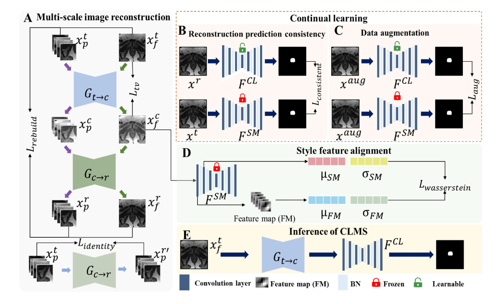

#  CLMS: Bridging Domain Gaps in Medical Imaging with Continual Learning for Source-Free Adaptation

This is the official PyTorch implementation of **CLMS** (Continual Learning Multi-Scale) .

CLMS: Bridging Domain Gaps in Medical Imaging with Continual Learning for Source-Free Adaptation.

# Get Started

## Environment
Python=3.7.7  
torch=1.7.0  
torchvision=0.8.1  
SimpleITK=2.2.0  
Pillow=8.2.0  
opencv-python=4.5.5.64  
scikit-image=0.17.2  
scikit-learn=0.23.2  
scipy=1.2.0  

## Datasets Preparation
"It is necessary to set the paths for the training data required for training the model in the options/base_options.py file."
 -  **Options Configuration in options/base_options.py:**
    -   `targetLibPath`: Path to the training dataset in the target domain.
    -   `augLibPath`: Path to the dataset in the augmented domain.
 -  **Format of Target Domain Training Set Files:**
    
    -   Files in `targetLibPath` are of type `.pt`.
    -   They can be accessed using `torch.load()`.
    -   The file format is a dictionary with a key 'slide', and the corresponding value is a list containing paths to target domain images. Example of Target Domain Training Set File (`targetDomain_train.pt`):
 - {  
       'slide': [  
           '/path/to/target/image1.jpg',  
           '/path/to/target/image2.jpg',  
           '/path/to/target/image3.jpg',
            ...  
       ] }  
 -  **Format of Augmented Domain Training Set Files:**
    
    -   Files in `augLibPath` are also of type `.pt`.
    -   Accessible using `torch.load()`.
    -  The file format is a dictionary with a key 'slide', and the corresponding value is a list containing paths to target domain images. Example of Augmented Domain Training Set File (`augmentation_train.pt`):
    - {  
       'slide': [  
           '/path/to/aug/image1.jpg',  
           '/path/to/aug/image2.jpg',  
           '/path/to/aug/image3.jpg',  
       ]  }  
   
## Load Source Model Weights file
After completing data preparation, it is necessary to load the source domain model weight. In the `options/base_options.py` file, the `checkpoints_dir` field represents the path to the source domain model weights.

## Train

 - Before training, you need to configure the weight saving path in the
   `checkpoints_dir` field in `options/base_options.py`. Set the desired
   batch size in the `batch_size` field, and specify the GPUs for
   training in the `gpu_ids` dictionary; this framework supports
   multi-GPU parallel training.
   
 - In `options/train_options.py`, adjust the `n_epochs` field to set the
   number of training epochs, and configure the learning rate with the  
   `lr` parameter.
 - For other training-related settings, please carefully review the   
   comments in `options/base_options.py` and `train_options.py`.
   
 - After completing the aforementioned setup, execute the command `python train.py` to commence the training process.

## Test
- After completing the training, you can set the paths for the target domain test set and source domain test set, as well as the loaded model weights in the `test/test.py` file. Execute the command `python test.py` to start the testing process.
